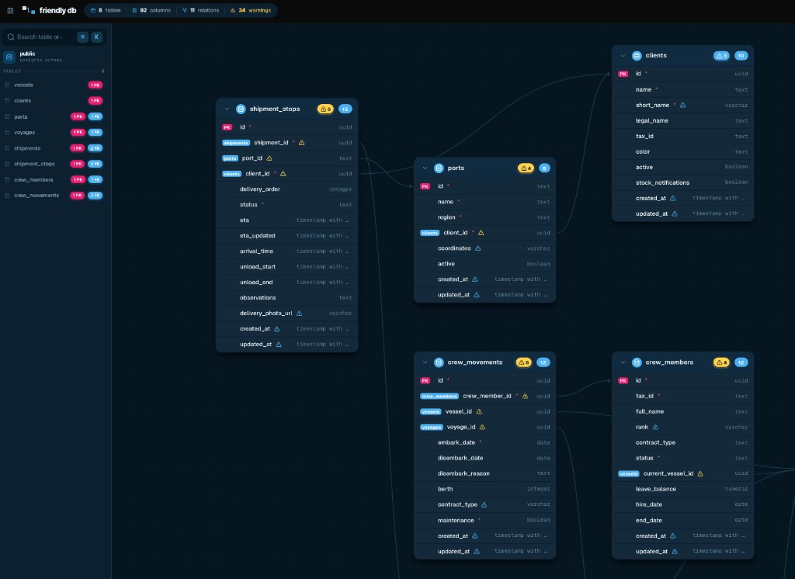

# Friendly DB

**Visualizá tu schema de PostgreSQL en segundos — sin backend, sin instalar nada.**

> 🌐 **[friendlydb.app](https://friendlydb.app)**

---

## ¿Por qué existe esto?

Honestamente, lo hice para uso personal.

Llevo un rato trabajando con Supabase y cuando el proyecto crece y empezás a tener muchas tablas, se vuelve un dolor de cabeza entender el schema. ¿Qué referencia qué? ¿Esta tabla tiene índice en la FK? ¿Hay alguna columna sin longitud que después me va a dar un warning? El editor de Supabase ayuda pero no da esa visión general que uno necesita.

Entonces hice **Friendly DB**: pegás tu DDL y al toque tenés un diagrama interactivo. Sin cuentas, sin servidores, todo corre en el browser.

Ahora lo publico por si le sirve a alguien más de la comunidad. 🙌

---

## Demo

---

## Screenshot

---

## ¿Qué hace?

- **Diagrama interactivo** — Las tablas aparecen como cards arrastrables. Podés reorganizarlas como quieras y **agrupar cadenas de tablas en distintos niveles** para construir el modelo mental que te haga sentido.
- **Foreign keys visuales** — Las relaciones entre tablas se dibujan con líneas. Seleccioná una tabla y se iluminan sus FK entrantes y salientes.
- **Detección de anti-patterns** — Te avisa si tenés FKs sin índice, tablas sin PK, o columnas de tipo `text`/`varchar` sin longitud especificada.
- **Búsqueda rápida** — `⌘K` / `Ctrl+K` para encontrar cualquier tabla o columna al instante.
- **Exportar** — Descargá el diagrama como PNG o SVG para compartir con tu equipo.
- **Link compartible** — Generá un link con el schema embebido (en el hash de la URL) para mandárselo a alguien sin que tenga que pegar el SQL de nuevo.
- **Sin backend** — Todo el parseo y renderizado ocurre en el browser. Tu SQL nunca sale de tu máquina.

---

## ¿Cómo lo uso?

1. Entrá a **[friendlydb.app](https://friendlydb.app)**
2. Hacé click en **"Open analyzer →"**
3. Pegá tu DDL de PostgreSQL en el modal (podés copiar directo de Supabase, psql, o cualquier cliente)
4. Listo — el diagrama aparece al instante

La app carga un schema de ejemplo al abrirla, así que podés explorar todas las funciones sin necesidad de configurar nada.

---

## Compatibilidad

Funciona con cualquier base de datos PostgreSQL:

| Plataforma | Estado |
|---|---|
| Supabase | ✅ |
| Neon | ✅ |
| Railway | ✅ |
| Amazon RDS | ✅ |
| Fly Postgres | ✅ |
| Crunchy Data | ✅ |
| Timescale | ✅ |
| PostgreSQL local | ✅ |

> El parser soporta `CREATE TABLE` con constraints inline y a nivel de tabla, y `ALTER TABLE ... ADD CONSTRAINT ... FOREIGN KEY`.

---

Hecho por un amante de Flutter ❤️

